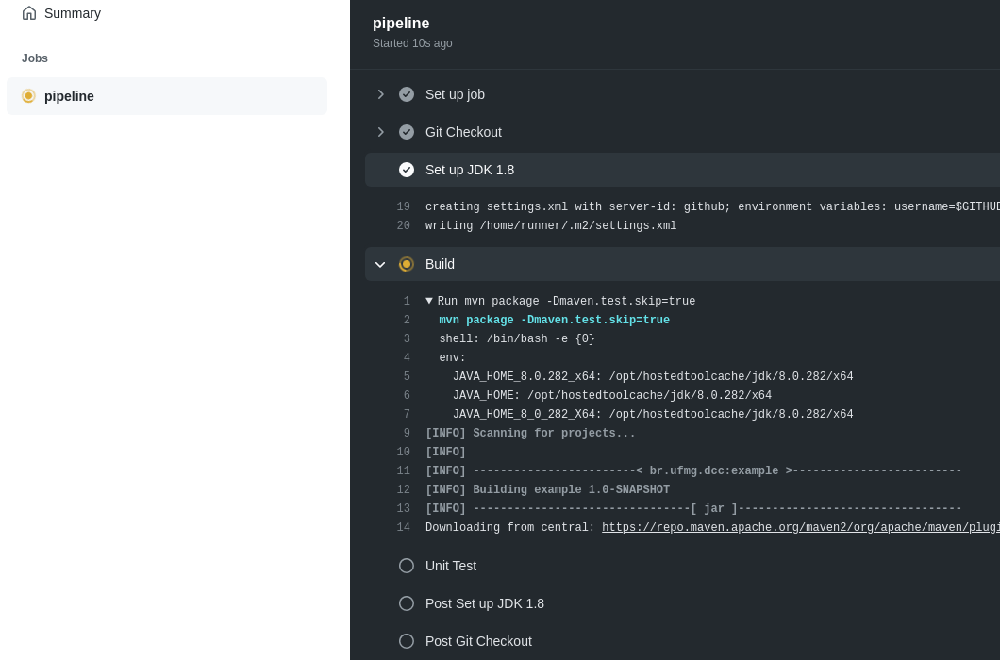
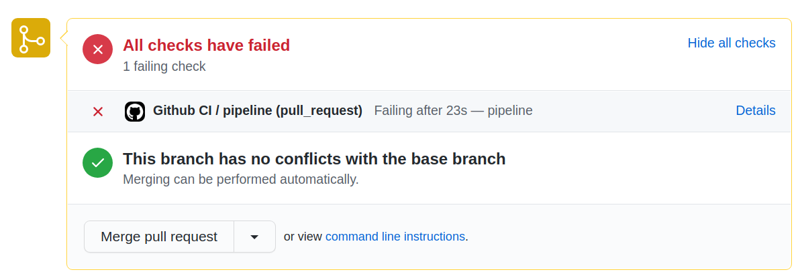

# Demo-CI: Hands-on Lecture on Continuous Integration Server

This repository presents a practical guide to set up and use a **Continous Integration (CI) Server**. The main objective of this guide is to provide students with a simple real first contact with this topic in Software Engineering.

For more details on **Continous Integration (CI)**, you may find several tutorials and content by searching the Web. The [Atlassian CI/CD](https://www.atlassian.com/continuous-delivery/continuous-integration) webpage has a good background content on this topic.

Even though there are many different **CI** servers, in this guide, we will use the native **CI** available in GitHub. In **GitHub Actions**, we can configure a CI server.


GitHub Actions allows us to execute external applications when GitHub detects pre-defined events in a repository. Our goal is to set up a CI server to compile our source code and run the test cases when a Pull Request (PR) is open (as shown in the diagram below). 


## Code Example

We are going to use a simple Java code as a basis for our CI server. The full source code is available at this repository in the "src" folder, called [SimpleCalculator.java](./src/main/java/br/ufmg/dcc/SimpleCalculator.java).


```java
public class SimpleCalculator {

  public int addition(int x, int y) {
    return x + y;
  }

  public int subtraction(int x, int y) {
    return x - y;
  }
  //... and other functions
}
```
When we create a PR to this repository, the CI server will automatically compile/build this program and run the unit test cases. We also create a simple (and incomplete) test case in this repository called [SimpleCalculatorTest.java](./src/test/java/br/ufmg/dcc/SimpleCalculatorTest.java).

```java
public class SimpleCalculatorTest {
  private SimpleCalculator calc;

  @BeforeEach
  public void init(){
    calc = new SimpleCalculator();
  }

  @Test
  public void testAddition1() {
    int expected = 5;
    int result = calc.addition(2,3);
    assertEquals(expected, result);
  }
  //...
}
```

## Task #1: Setting Up GitHub Actions

#### Step 1

The very first thing to do is to fork this repository. Click on the **Fork** button on the top right corner of this page.

Therefore, you will set up the CI server into your own copy of the repository.

#### Step 2

Clone the repository into your local machine. You may use a Git Client for it or the following command line (where `<USER>` should be replaced by your GitHub user).

```bash
git clone https://github.com/<USER>/demo-ci.git
```

Next, go to the folder `.github/workflows/` (the **dot** at the begging means it is invisible on Unix/Mac, so use the GitHub web interface), and rename the empty file to `actions.yaml`. Add the content below to the `actions.yaml` file

```yaml
name: Github CI
on:
  # Set up a CI Server to execute the jobs pipeline below when 
  # a push or pull request is made at the main branch
  push:
    branches:
      - main
  pull_request:
    branches:
      - main

jobs:
  pipeline:
    runs-on: ubuntu-latest # Commands must be executed on a Linux Ubuntu OS

    steps:
      - name: Git Checkout
        uses: actions/checkout@v2 # Checkout the received code 

      - name: Set up JDK 1.8
        uses: actions/setup-java@v1 # Set up Java 1.8
        with:
          java-version: 1.8

      - name: Build
        run: mvn package -Dmaven.test.skip=true # Build (compiles) the source code

      - name: Unit Test
        run: mvn test # Executes the testing framework 
```

This file will activate and set up GitHub Actions to -- every time a `push` or `pull_request` event on this repository main brach -- run three jobs:

- checkout the source code;
- build the sources;
- execute the testing framework.

#### Step 3

Make a `commit` and a `git push`. You may use a Git Client for it, or use the following command line:

```bash
git add --all
git commit -m "Setting up GitHub Actions"
git push origin main
```

#### Step 4

When your `push` reaches the main repository, GitHub Actions will begin to automatically execute the jobs listed inside the file `actions.yaml` (in our case, the checkout + build + tests). 

You may watch over the status of the jobs being executed by clicking on the Actions tab inside your repository.



## Task #2: Creating a buggy Pull Request

Now lets see our CI server performing in real live action. We will introduce a simple bug in our code example and send a Pull Request. The CI server will alert to the failed tests in our PR and will not automatically integrate it to the main branch.

#### Step 1

Click on the "Main" dropdown button on top. Type the name of branch on the text field. I called my branch `buggy` (adapt accordingly if you change the name).


You may also create a branch by using the command-line below:
```bash
git checkout -b buggy
```

#### Step 2

Change the function `addition` in the file [SimpleCalculator.java](./src/main/java/br/ufmg/dcc/SimpleCalculator.java) to work incorrectly (i.e., we are introducing a defect on it). For example, we can change line 6, and modify the return to `x + y + 1`, as detailed below.

```diff
--- a/src/main/java/br/ufmg/dcc/SimpleCalculator.java
+++ b/src/main/java/br/ufmg/dcc/SimpleCalculator.java
@@ -3,7 +3,7 @@ package br.ufmg.dcc;
 public class SimpleCalculator {

   public int addition(int x, int y) {
-    return x + y;
+    return x + y + 1;
   }

   public int subtraction(int x, int y) {
```

#### Step 3

If you modified the source file directly in 'buggy' branch editing in the GitHub web interface, then you may skip this step.  
Otherwise, we need to commit-push the changed code to the 'buggy' branch. Use a Git Client or the command line:

```bash
git commit -m "Changing function addition"
git push origin buggy
```

#### Step 4

Now, create a Pull Request (PR) with your changes. You may click on the Pull Request tab on your GitHub repository and manually navigate the options to create a PR from your buggy branch to your main branch. Or just type the following URL in your browser (where `<USER>` should be replaced by your GitHub user).
```bash
https://github.com/<USER>/demo-ci/compare/main...buggy
```  
You will see the comparison between the differences of both branches, and write a description for your PR.


After you create the Pull Request, the job pipeline we defined in GitHub Actions will be triggered. **Do not merge**, wait at least 1 minute and you will see the results. GitHub itself will build the system and run the tests (just like it did in Task #1). However, this time the tests will fail, as shown in the figure below.



**SUMMARIZING**: The CI Server managed to automatically warn both the PR author and the integrator that there exists a problem in the submitted code.

## Credits

This guide was conceptualized and originally written by **Rodrigo Brito**, an MSc student in DCC/UFMG in Feb/2020, under the advisement of **Prof. Marco Túlio Valente**. This guide was translated and adapted to English by **Prof. Henrique Rocha**, at Loyola University Maryland, in Nov/2021. 
